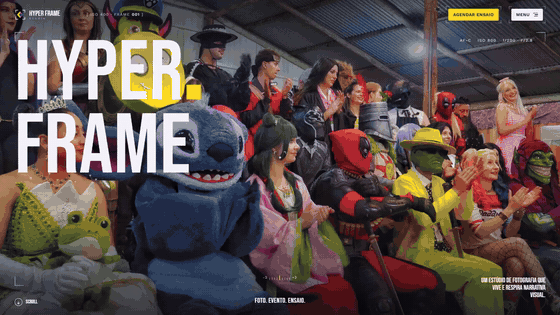
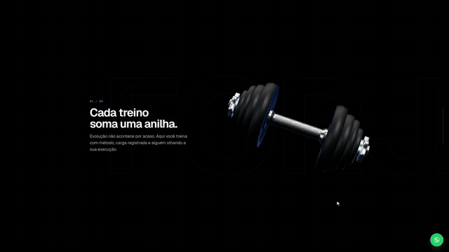
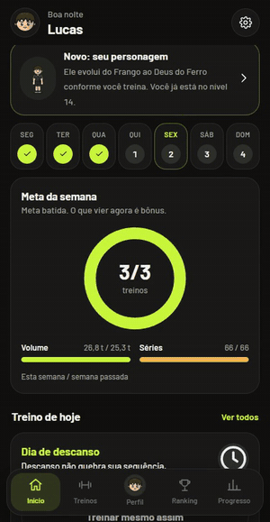

# WZS Studio · Portfólio

Portfólio de **Wesley Zanchettin de Souza**, desenvolvedor front-end de Vila Flores, RS, atendendo toda a região. Demonstrações em vídeo de sites, landing pages e sistemas escritos do zero.

Este próprio site é HTML, CSS e JavaScript puros, com GSAP, Lenis e um terminal interativo.

**▶ Assista na página do portfólio: https://wzsstudio.github.io/portfolio/**

---

## JurisConta — sistema para escritórios de advocacia

⭐ **Projeto em destaque** · [jurisconta.com](https://jurisconta.com)

Plataforma web de gestão jurídica: intimações capturadas do DJEN pelo número da OAB, calculadoras com memória de cálculo, assistente que cita a fonte oficial, modelos que viram .docx, casos, agenda e indicadores.

Node.js · Express · MySQL · IA com RAG — [vídeo do site de apresentação (0:45)](videos/jurisconta-site.mp4)

## Dolce Migliavaca — site para confeitaria

🌐 **No ar:** [dolce-migliavaca.pages.dev](https://dolce-migliavaca.pages.dev)

Site de uma página para confeitaria caseira: cheesecake em 3D que gira com o mouse ou o dedo, cardápio arrastável com pedido direto no WhatsApp, galeria com revelação na rolagem e área de tele-entrega. Logo e identidade visual criados para o projeto.

HTML · CSS · JavaScript · Three.js · Cloudflare Pages — [vídeo completo (0:19)](videos/dolce-migliavaca.mp4)

> Modelo 3D [“Cheese Cake”](https://sketchfab.com/3d-models/cheese-cake-7290e12a31d04cb3892049f379c4bafb) por [rebuilderai](https://sketchfab.com/RebuilderAI-vrin) (Sketchfab), licença [CC BY 4.0](https://creativecommons.org/licenses/by/4.0/deed.pt-br).

## Hyper Frame Studio — site para estúdio de fotografia

Site para estúdio de fotografia de eventos, ensaios e cosplay: abertura com o logo em pixel, mosaico de fotos animado pela rolagem, câmera desenhada que vira visor do portfólio, serviços, ensaio autoral, galeria com filtros e formulário de contato.

HTML · CSS · JavaScript · GSAP · ScrollTrigger · Lenis — [vídeo completo (0:38)](videos/hyper-frame.mp4)

> Fotos: acervo do Hyper Frame Studio.

## Forja Academia — site para academia

Landing page com halter 3D animado pela rolagem (Three.js), vídeo de fundo, modalidades, grade de horários, FAQ, mapa e contato via WhatsApp.

HTML · CSS · JavaScript · Three.js — [vídeo completo (0:56)](videos/forja-academia.mp4)

> Marca fictícia criada para o portfólio. Fotos e vídeo do Pexels (licença livre).

## App de treino — PWA para celular

Meta semanal, montagem de treinos, registro de séries e cargas com cronômetro, evolução por exercício, músculos trabalhados, dieta, sequência de dias e ranking entre amigos.

PWA · JavaScript · Supabase — [vídeo completo (0:45)](videos/app-fitness.mp4)

---

## Orçamento

Faça já seu orçamento:

- WhatsApp: [+55 54 99714-7741](https://wa.me/5554997147741)
- E-mail: [wzs.studio11@gmail.com](mailto:wzs.studio11@gmail.com)
